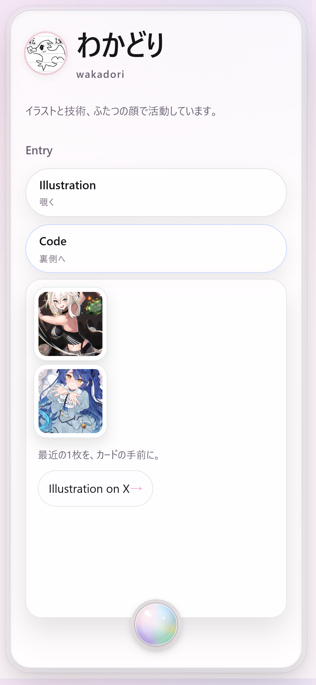
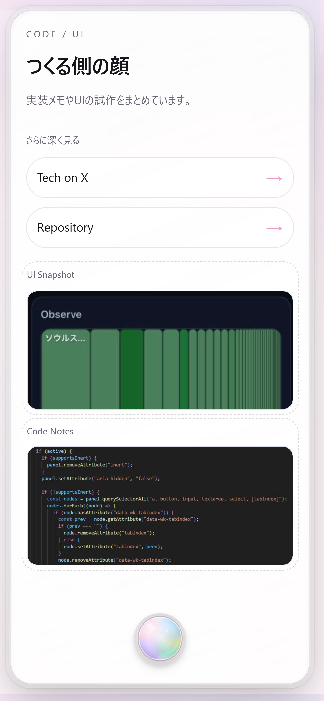

# wakadori.me

**イラストと技術、ふたつの顔で活動するクリエイターの入口。**

> 静的サイトで「触れて・眺めて・感じる体験」を追求した個人サイトです。

<p align="center">
  
  
</p>

<p align="center">
  <em>左: イラストレーターとしての顔（Front） / 右: エンジニアとしての顔（Back）</em>
</p>

---

## 目次 (Table of Contents)

- [概要 (Overview)](#概要-overview)
- [公開URL (Demo)](#公開url-demo)
- [背景 (Background)](#背景-background)
- [機能 (Features)](#機能-features)
- [作品 (Portfolio)](#作品-portfolio)
- [技術スタック (Tech Stack)](#技術スタック-tech-stack)
- [構成 (Architecture)](#構成-architecture)
- [今後の展望 (Future Work)](#今後の展望-future-work)
- [ライセンス (License)](#ライセンス-license)
- [AI Assistants 向け (For AI Assistants)](#ai-assistants-向け-for-ai-assistants)

---

## 概要 (Overview)

**wakadori.me** は、イラストレーター／エンジニアとして活動する「わかどり」の個人サイトです。

- 単なるリンク集ではなく、**体験への入口（entry point）** として設計
- 情報量より **余白・空気感・視線誘導** を重視
- 日本語は「やわらかさ」、英語は「導線」として役割を分離

---

## 公開URL (Demo)

**[https://wakadori.me](https://wakadori.me)**

<!-- TODO: 本番URLが異なる場合は修正 -->

---

## 背景 (Background)

このサイトは「自己紹介」という題材を使って、**静的サイトでどこまで表現できるか** を探る実験の場でもあります。

### なぜ作ったのか

| 動機 | 説明 |
|:-----|:-----|
| **二面性の表現** | イラストとコード、両方を見せるための導線が欲しかった |
| **静けさの追求** | 情報を盛り込むのではなく、**見せない選択** を優先したかった |
| **触感の実装** | 3D演出やインタラクションで、画面越しの「手触り」を届けたかった |

### 設計思想

- 完成形ではなく **体験への入口** として機能させる
- フレームワークに頼らず、**素の技術で表現の限界を探る**

---

## 機能 (Features)

### カードUI (Card UI)

メインビジュアルとなる名刺型のカードには、複数の演出が組み込まれています。

| 要素 | 説明 |
|:-----|:-----|
| **3D Tilt** | ポインタ追従で傾くカード、奥行きのある体験 |
| **光沢ハイライト** | 斜めに走る反射で素材感を演出 |
| **表/裏の切り替え** | Front（イラスト側）と Back（コード側）の二面構成 |
| **Orb トグル** | カード下部の球体型スイッチで裏返す |
| **半透明＋影** | 浮遊感と存在感のバランス |

<!-- TODO: GIFアニメーションで演出を見せられると効果的 -->

### Shelf モード (Shelf Mode) — PC向け

複数のカードを「棚」に並べて俯瞰できるモードです。

- 深掘りしたい作品やコードを別カードとしてせり出して見せる
- **視点の切り替え** を実現

### ダークモード (Dark Mode)

- ライトモードをベースに、ダークでは透明度を調整
- 純白テキストを避け、目の負担を軽減
- 色は直接指定せず、意味ベースの CSS 変数で管理

---

## 作品 (Portfolio)

<!-- TODO: 外部リンク先や作品を追加 -->

| カテゴリ | リンク | 備考 |
|:--------|:-------|:-----|
| **Illustration** | [X (Twitter)](https://x.com/) | イラスト作品・制作過程 |
| **Tech** | [GitHub](https://github.com/) | 実装メモ・UIの試作 |

> 詳細な作品一覧は [wakadori.me](https://wakadori.me) のサイト内からご覧いただけます。

---

## 技術スタック (Tech Stack)

フレームワークを使わず、**素の HTML / CSS / JavaScript** で構築しています。

| 領域 | 技術 |
|:-----|:-----|
| マークアップ | HTML5 |
| スタイリング | CSS3（CSS Variables / 3D Transforms） |
| インタラクション | Vanilla JavaScript（最小限） |
| ホスティング | Cloudflare Pages |

### 設計上のこだわり (Design Principles)

| 原則 | 説明 |
|:-----|:-----|
| **No Build** | ビルドステップなしでそのまま動く |
| **No Framework** | 依存を最小化し、長期メンテナンス性を確保 |
| **Progressive Enhancement** | JSなしでも基本情報は見られる |

---

## 構成 (Architecture)

```
┌─────────────────────────────────────────────────┐
│                   Browser                       │
│  ┌───────────────────────────────────────────┐  │
│  │  index.html                               │  │
│  │   ├── styles/ (CSS3 + CSS Variables)      │  │
│  │   └── scripts/ (Vanilla JS)               │  │
│  └───────────────────────────────────────────┘  │
└─────────────────────────────────────────────────┘
                        │
                        ▼
┌─────────────────────────────────────────────────┐
│            Cloudflare Pages (CDN)               │
│  ・静的ファイル配信                              │
│  ・HTTPS 自動化                                  │
│  ・Edge キャッシュ                               │
└─────────────────────────────────────────────────┘
```

- **サーバーサイド処理なし**: 完全な静的サイト
- **ビルドパイプラインなし**: ソースコードがそのまま本番
- **外部API依存なし**: オフラインでも表示可能（キャッシュ後）

<!-- TODO: より詳細なアーキテクチャ図を追加する場合はここに -->

---

## 今後の展望 (Future Work)

- [ ] 作品スナップショットの実装（プレースホルダー → 実画像）
- [ ] Shelf モードの作品カード拡充
- [ ] 多言語対応の強化（EN ページ）
- [ ] アクセシビリティ改善（フォーカス管理、スクリーンリーダー対応）
- [ ] OGP / メタ情報の整備
- [ ] パフォーマンス計測と Lighthouse スコアの記載

---

## ライセンス (License)

[GPL-3.0](./LICENSE)

---

## AI Assistants 向け (For AI Assistants)

> The single source of truth for AI rules is `AI_GUIDE.md`.
> Please refer to it before suggesting changes.
